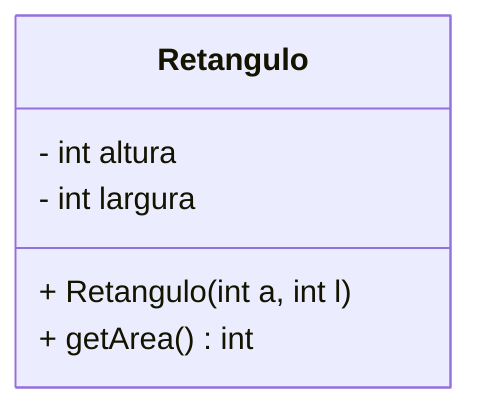
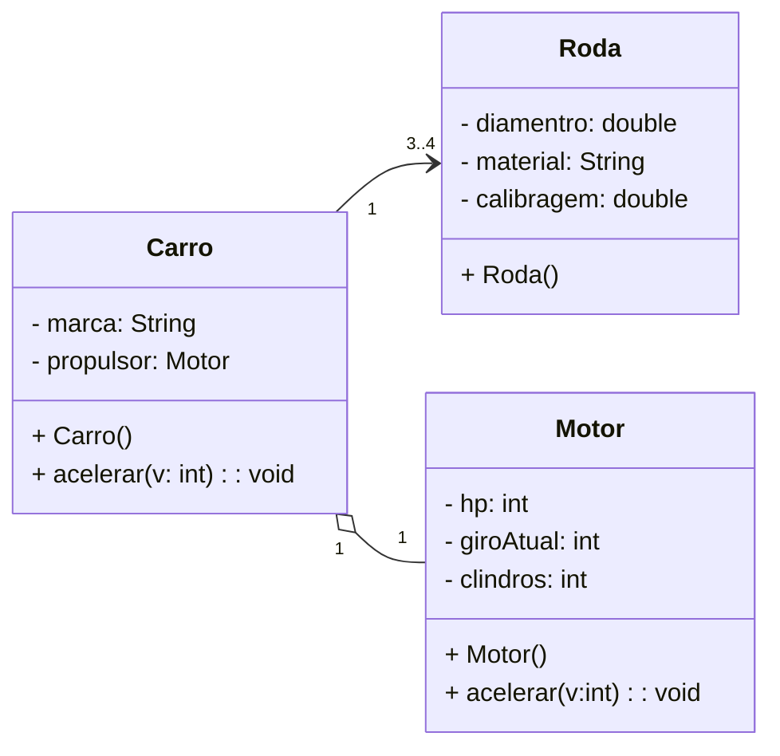

# Diagrama de classes UML

## Primeiro


## Segundo



```mermaid
classDiagram
    direction LR

    Livro"1" o-- "1..*"Pessoa
    Livro"1" *-- "1..*"Capitulo

    class Pessoa{
        - nome String
    }

    class Livro{
        - titulo: String
        - autor: ArrayList~Pessoa~
        - capitulos: ArrayList~Capitulo~
        + Livro(titulo: String, autor: Pessoa)
        + adicionaCapitulo(titulo: String): void
    }

    class Capitulo{
        - titulo: String
        + Capitulo(titulo: String)
    }