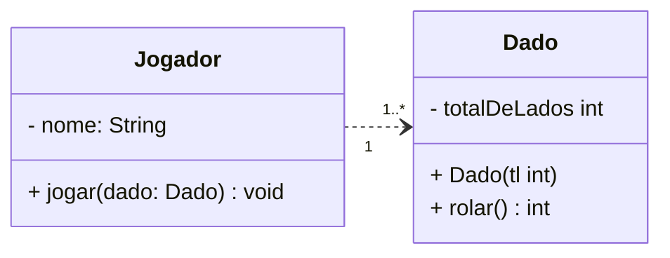
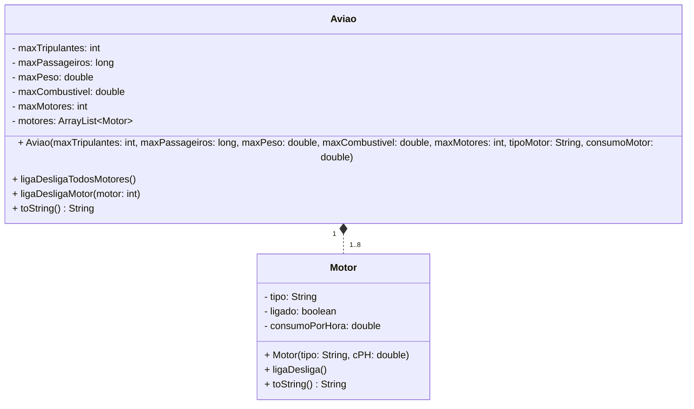

# Associações

## Dependência (..>)

```mermaid
classDiagram
    direction LR
    
    Jogador"1" ..> "1..*"Dado

    class Jogador{
        - nome: String
        + jogar(dado: Dado) void
    }

    class Dado{
        - totalDeLados int
        + Dado(tl int)
        + rolar() int
    }
```

## Exercício 1

```mermaid
classDiagram
    direction TB

    Aviao"1" *.. "1..8"Motor

    class Aviao{
        - maxTripulantes: int
        - maxPassageiros: long
        - maxPeso: double
        - maxCombustivel: double
        - maxMotores: int
        - motores: ArrayList~Motor~
        + Aviao(maxTripulantes: int, maxPassageiros: long, maxPeso: double, maxCombustivel: double, maxMotores: int, tipoMotor: String, consumoMotor: double)
        + ligaDesligaTodosMotores()
        + ligaDesligaMotor(motor: int)
        + toString() String
    }

    class Motor{
        - tipo: String
        - ligado: boolean
        - consumoPorHora: double
        + Motor(tipo: String, cPH: double)
        + ligaDesliga()
        + toString() String
    }
```