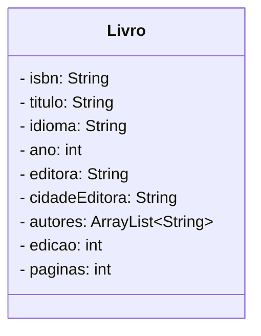
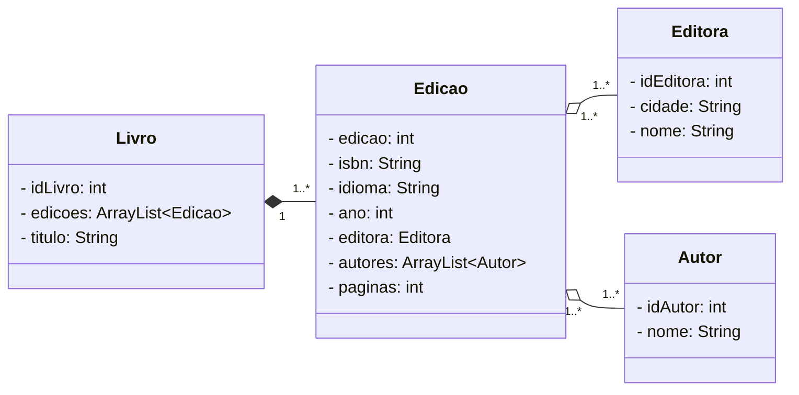
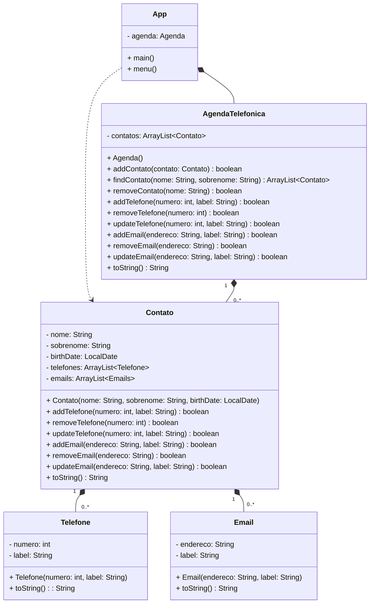

# Anotações

Clique aqui para expandir

## Modelando entidades e relacionamentos

> mas, nem todos os atributos são somente do livro 

## Princípio da responsabilidade única
> Separation of Concerns (SoC)
> --> Facilita a manutenção

### Sistema para Gestão de Agenda Telefônica
