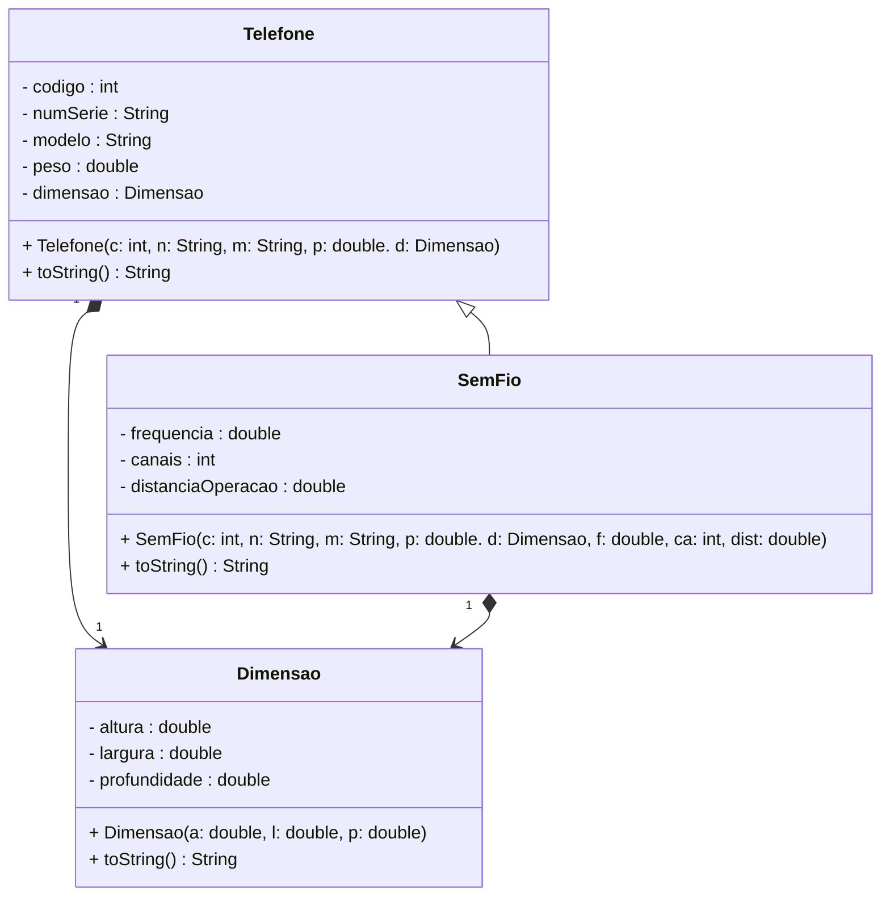
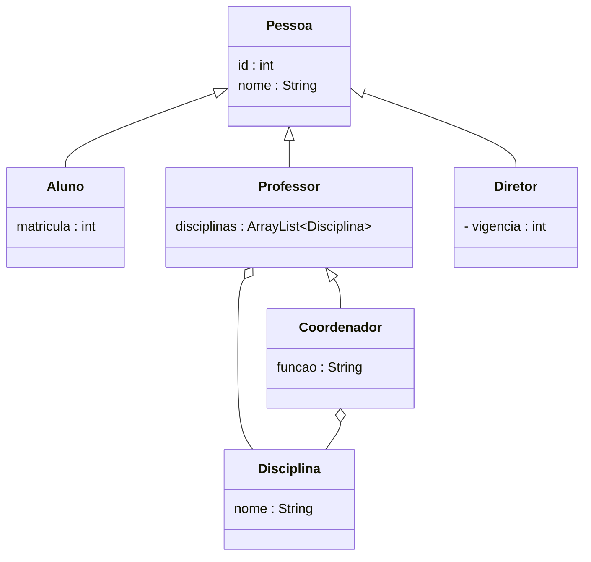
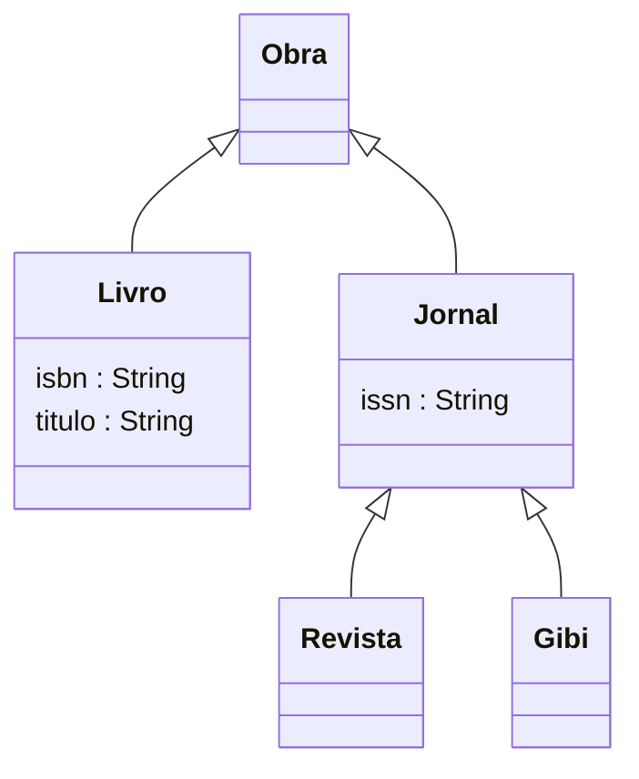
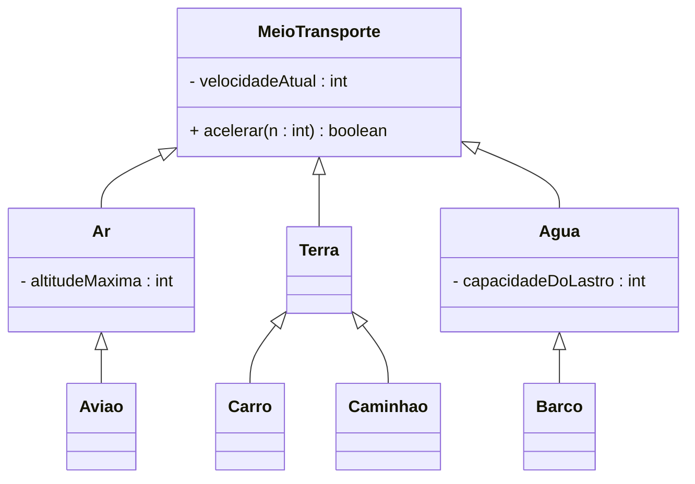
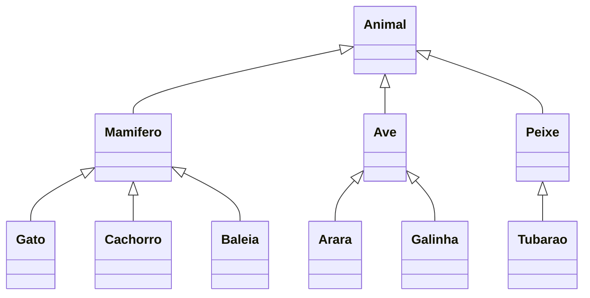

# Herança

> Use herança quando diferentes classes precisam compartilhar características e comportamentos comuns, mas também possuem particularidades

- Herança permite criar novas classes a partir de classes já existentes, facilitando o desenvolvimento de sistemas complexos
- A subclasse (ou classe filha) herda os atributos da classe (classe pai)

## Exemplo: Sistema para cadastro de produtos

## Membros protegidos
- Protected apresenta uma restrição intermediária entre o private e o público

## Exercícios em sala

### Exercício 1

### Exercício 2

### Exercício 3

### Exercício 4
