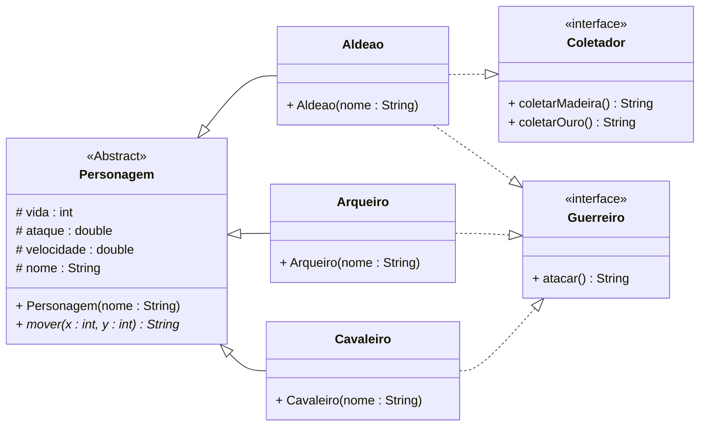

# Java of Empires

```mermaid
classDiagram
direction LR

    Personagem <|-- Aldeao
    Personagem <|-- Arqueiro
    Personagem <|-- Cavaleiro
    Aldeao ..|> Coletador
    Aldeao ..|> Guerreiro
    Arqueiro ..|> Guerreiro
    Cavaleiro ..|> Guerreiro

    class Personagem {
        <<Abstract>>
        
        # vida : int
        # ataque : double
        # velocidade : double
        # nome : String
        + Personagem(nome : String)
        + mover(x : int, y : int) String*
    }

    class Coletador {
        <<interface>>
        + coletarMadeira() String
        + coletarOuro() String
    }

    class Guerreiro {
        <<interface>>
        + atacar() String
    }

    class Aldeao {
        + Aldeao(nome : String)
    }

    class Arqueiro {
        + Arqueiro(nome : String)
    }

    class Cavaleiro {
        + Cavaleiro(nome : String)
    }

```