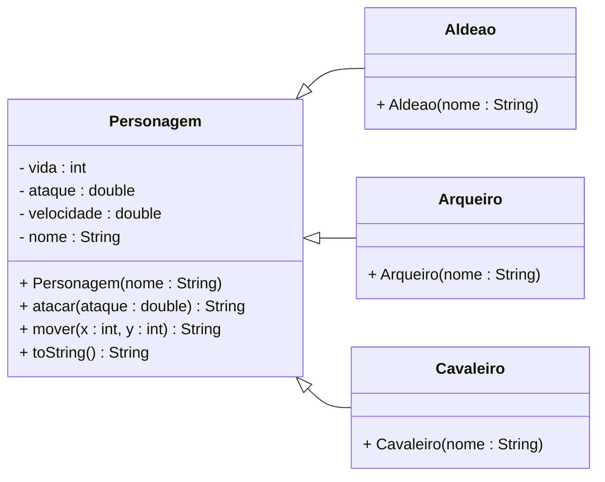

# Java of Empires

```mermaid
classDiagram
direction LR

    Personagem <|-- Aldeao
    Personagem <|-- Arqueiro
    Personagem <|-- Cavaleiro

    class Personagem {
        - vida : int
        - ataque : double
        - velocidade : double
        - nome : String
        + Personagem(nome : String)
        + atacar(ataque : double) String
        + mover(x : int, y : int) String
        + toString() String
    }

    class Aldeao {
        + Aldeao(nome : String)
    }

    class Arqueiro {
        + Arqueiro(nome : String)
    }

    class Cavaleiro {
        + Cavaleiro(nome : String)
    }

```