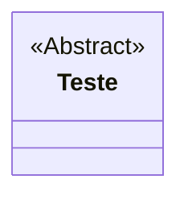
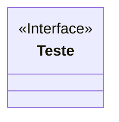

# Conversão de tipos (typecasting)

> Operador ```instanceof``` serve para verificar o tipo de um objeto

```Java
    Telefone produtos[] = new Telefone[3];
    produtos[0] = new Telefone();
    produtos[1] = new SemFio();
    produtos [2] = new Celular();

    for (Telefone t : produtos) {
        if (t instanceof Celular c) {
            String sistemaOperacional = c.getSistemaOperacional();
            System.out.println("Celular com SO: " + sistemaOperacional);
        }
    }
```

# Classe Abstrata

- É uma classe que não pode ser instaciada.
- Pode ter atributos, métodos concretos e métodos abstratos.



# Herança múltipla

## Interface
- Todos os atributos são public static final (constantes)
- Não pertencem às classes, mas à interface
- Todos os métodos são public abstract por padrão

