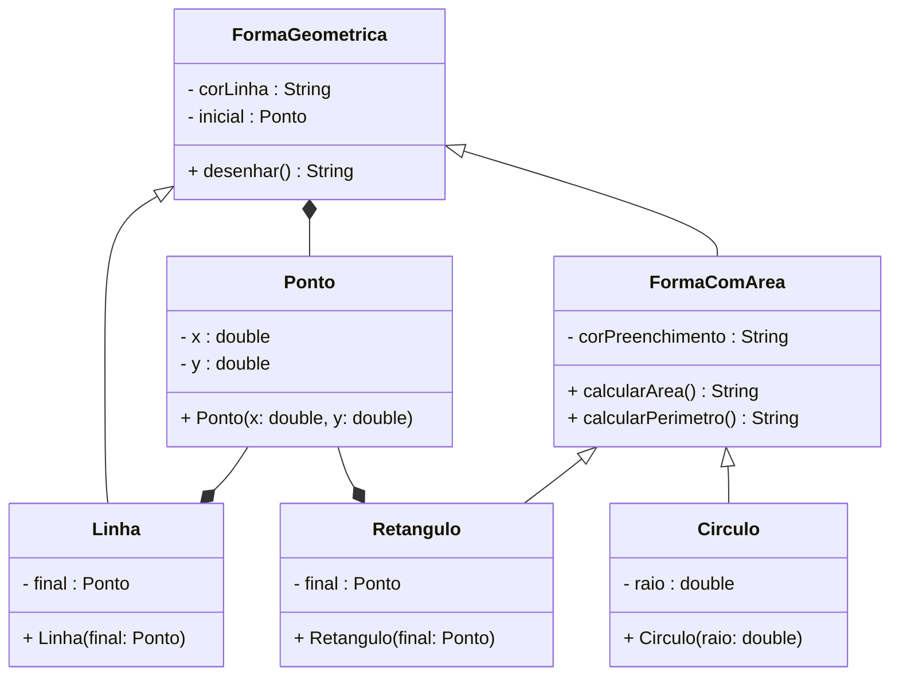

# Aplicativo para desenho vetorial 2D

```mermaid
classDiagram

FormaGeometrica *-- Ponto
FormaGeometrica <|-- FormaComArea
FormaGeometrica <|-- Linha
Ponto --* Linha
FormaComArea <|-- Circulo
Ponto --* Retangulo
FormaComArea <|-- Retangulo

class FormaGeometrica {
    - corLinha : String
    - inicial : Ponto
    + desenhar() String
}

class FormaComArea {
    - corPreenchimento : String
    + calcularArea() String
    + calcularPerimetro() String
}

class Ponto {
    - x : double
    - y : double
    + Ponto(x: double, y: double)
}

class Linha {
    - final : Ponto
    + Linha(final: Ponto)
}

class Circulo {
    - raio : double
    + Circulo(raio: double)
}

class Retangulo {
    - final : Ponto
    + Retangulo(final: Ponto)
}

```