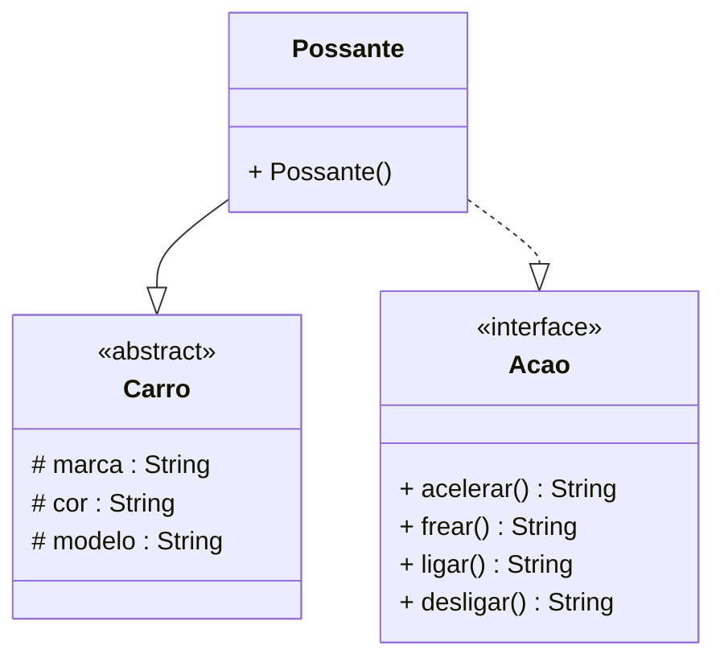

# Jogo de corrida

```mermaid
classDiagram

    Possante --|> Carro
    Possante ..|> Acao

    class Possante {
        + Possante()
    }

    class Carro {
        <<abstract>>
        # marca : String
        # cor : String
        # modelo : String
    }

    class Acao {
        <<interface>>
        + acelerar() String
        + frear() String
        + ligar() String
        + desligar() String
    }

```