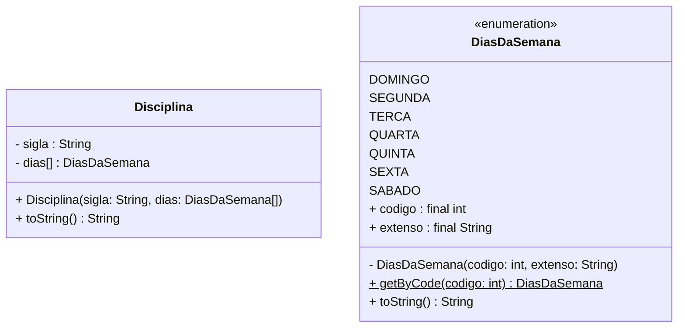

```mermaid
classDiagram

    class Disciplina {
        - sigla : String
        - dias[] : DiasDaSemana 
        + Disciplina(sigla: String, dias: DiasDaSemana[])
        + toString() String
    }

    class DiasDaSemana {
        <<enumeration>>
        DOMINGO
        SEGUNDA
        TERCA
        QUARTA
        QUINTA
        SEXTA
        SABADO
        + codigo : final int
        + extenso : final String
        - DiasDaSemana(codigo: int, extenso: String)
        + getByCode(codigo: int) DiasDaSemana$
        + toString() String
    }

```