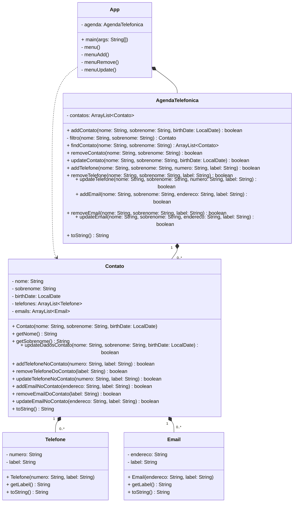

# Sistema para Gestão de Agenda Telefônica

```mermaid
classDiagram
    direction TB

    App ..> Contato
    App *-- AgendaTelefonica
    AgendaTelefonica"1" *-- "0..*"Contato
    Contato"1" *-- "0..*"Telefone
    Contato"1" *-- "0..*"Email

    class App{
        - agenda: AgendaTelefonica
        + main(args: String[])
        - menu()
        - menuAdd()
        - menuRemove()
        - menuUpdate()
    }

    class AgendaTelefonica{
        - contatos: ArrayList~Contato~
        + addContato(nome: String, sobrenome: String, birthDate: LocalDate) boolean
        - filtro(nome: String, sobrenome: String) Contato
        + findContato(nome: String, sobrenome: String) ArrayList~Contato~
        + removeContato(nome: String, sobrenome: String) boolean
        + updateContato(nome: String, sobrenome: String, birthDate: LocalDate) boolean
        + addTelefone(nome: String, sobrenome: String, numero: String, label: String) boolean
        + removeTelefone(nome: String, sobrenome: String, label: String) boolean
        + updateTelefone(nome: String, sobrenome: String, numero: String, label: String) boolean
        + addEmail(nome: String, sobrenome: String, endereco: String, label: String) boolean
        + removeEmail(nome: String, sobrenome: String, label: String) boolean
        + updateEmail(nome: String, sobrenome: String, endereco: String, label: String) boolean
        + toString() String
    }

    class Contato{
        - nome: String
        - sobrenome: String
        - birthDate: LocalDate
        - telefones: ArrayList~Telefone~
        - emails: ArrayList~Email~
        + Contato(nome: String, sobrenome: String, birthDate: LocalDate)
        + getNome() String
        + getSobrenome() String
        + updateDadosContato(nome: String, sobrenome: String, birthDate: LocalDate) boolean
        + addTelefoneNoContato(numero: String, label: String) boolean
        + removeTelefoneDoContato(label: String) boolean
        + updateTelefoneNoContato(numero: String, label: String) boolean
        + addEmailNoContato(endereco: String, label: String) boolean
        + removeEmailDoContato(label: String) boolean
        + updateEmailNoContato(endereco: String, label: String) boolean
        + toString() String
    }

    class Telefone{
        - numero: String
        - label: String
        + Telefone(numero: String, label: String)
        + getLabel() String
        + toString() String
    }

    class Email{
        - endereco: String
        - label: String
        + Email(endereco: String, label: String)
        + getLabel() String
        + toString() String
    }
```