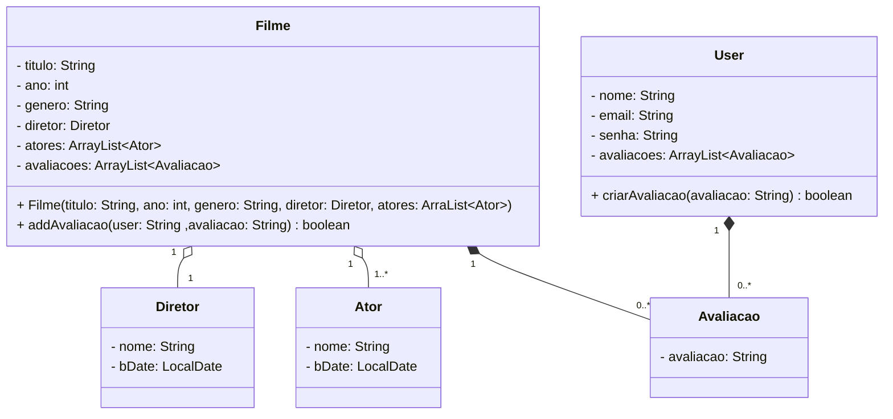

# Sistema de avaliação de filmes

```mermaid
classDiagram
    direction TB

    Filme"1" o-- "1"Diretor
    Filme"1" o-- "1..*"Ator
    User"1" *-- "0..*"Avaliacao
    Filme"1" *-- "0..*"Avaliacao

    class Filme {
        - titulo: String
        - ano: int
        - genero: String
        - diretor: Diretor
        - atores: ArrayList~Ator~
        - avaliacoes: ArrayList~Avaliacao~
        + Filme(titulo: String, ano: int, genero: String, diretor: Diretor, atores: ArraList~Ator~)
        + addAvaliacao(user: String ,avaliacao: String) boolean
    }

    class Diretor {
        - nome: String
        - bDate: LocalDate
    }

    class Ator {
        - nome: String
        - bDate: LocalDate
    }

    class Avaliacao {
        - avaliacao: String
    } 

    class User {
        - nome: String
        - email: String
        - senha: String
        - avaliacoes: ArrayList~Avaliacao~
        + criarAvaliacao(avaliacao: String) boolean
    }
```