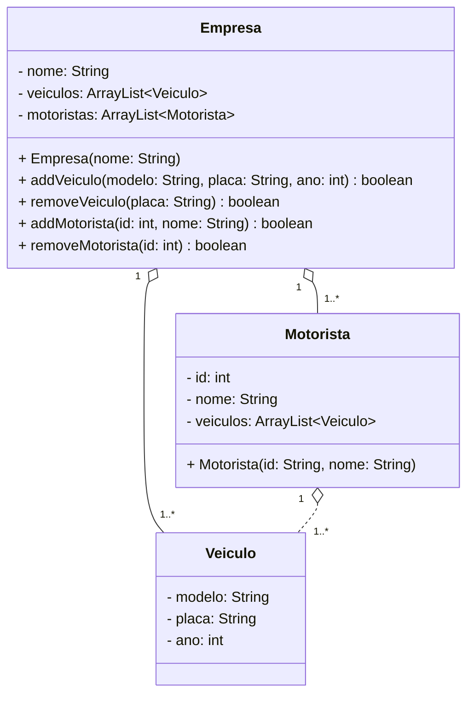

# Sistema de Gestão de Frotas

```mermaid
classDiagram
    direction TB

    Empresa"1" o-- "1..*"Veiculo
    Empresa"1" o-- "1..*"Motorista
    Motorista"1" o.. "1..*"Veiculo

    class Empresa {
        - nome: String
        - veiculos: ArrayList~Veiculo~
        - motoristas: ArrayList~Motorista~

        + Empresa(nome: String)
        + addVeiculo(modelo: String, placa: String, ano: int) boolean
        + removeVeiculo(placa: String) boolean
        + addMotorista(id: int, nome: String) boolean
        + removeMotorista(id: int) boolean
    }

    class Veiculo {
        - modelo: String
        - placa: String
        - ano: int
    }

    class Motorista {
        - id: int
        - nome: String
        - veiculos: ArrayList~Veiculo~ 

        + Motorista(id: String, nome: String)
    }
```