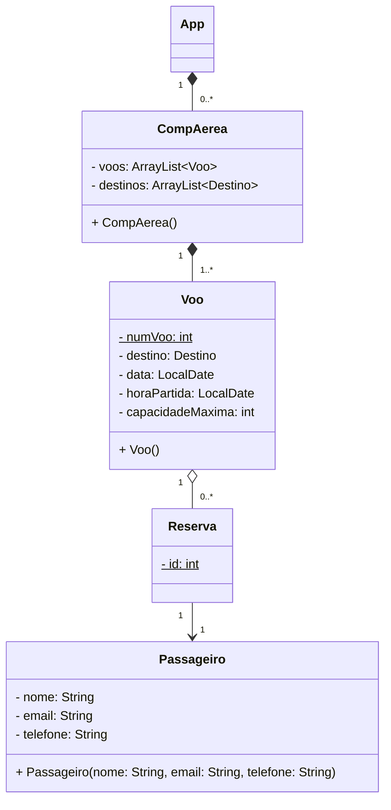

# Sistema de Reserva de Passagens Aéreas

> Uma companhia aérea oferece voos para diversos destinos. Cada voo tem um número de voo, um destino,
uma data e uma hora de partida, e uma capacidade máxima de passageiros. Os passageiros podem reservar
assentos em um voo, e cada reserva está associada a um único passageiro e a um único voo. Um passageiro
tem um nome, um e-mail e um número de telefone.

