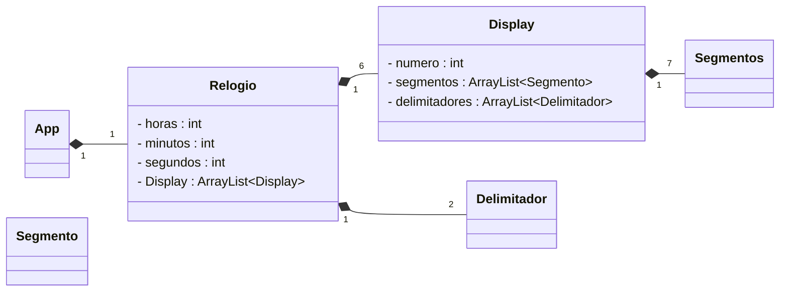

# Relógio Digital

```mermaid
classDiagram
direction LR

    App"1" *-- "1"Relogio
    Relogio"1" *-- "6"Display
    Display"1" *-- "7"Segmentos
    Relogio"1" *-- "2"Delimitador

    class App {

    }

    class Relogio {
        - horas : int
        - minutos : int
        - segundos : int
        - Display : ArrayList~Display~
    }

    class Display {
        - numero : int
        - segmentos : ArrayList~Segmento~
        - delimitadores : ArrayList~Delimitador~

    }

    class Segmento {

    }

    class Delimitador {

    }
```