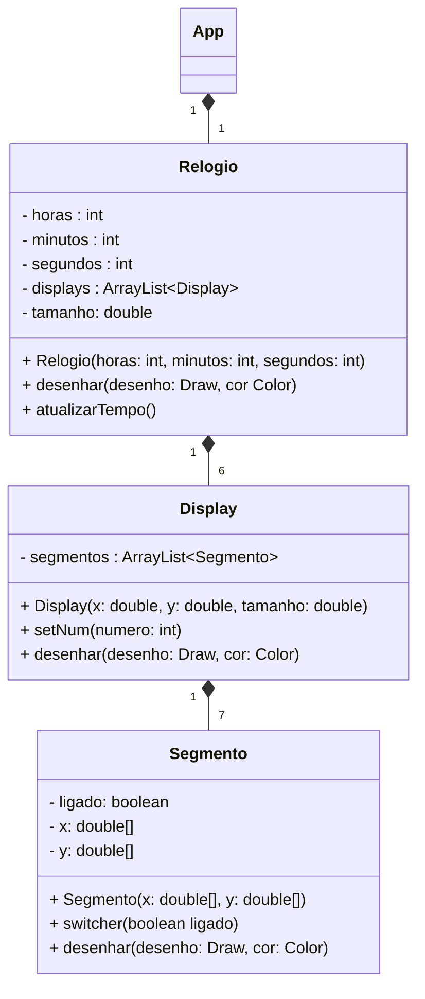

# Relógio Digital

```mermaid
classDiagram
    
    App"1" *-- "1"Relogio
    Relogio"1" *-- "6"Display
    Display"1" *-- "7"Segmento

    class App {

    }

    class Relogio {
        - horas : int
        - minutos : int
        - segundos : int
        - displays : ArrayList~Display~
        - tamanho: double
        + Relogio(horas: int, minutos: int, segundos: int)
        + desenhar(desenho: Draw, cor Color)
        + atualizarTempo()
    }

    class Display {
        - segmentos : ArrayList~Segmento~
        + Display(x: double, y: double, tamanho: double)
        + setNum(numero: int)
        + desenhar(desenho: Draw, cor: Color)
    }

    class Segmento {
        - ligado: boolean
        - x: double[]
        - y: double[]
        + Segmento(x: double[], y: double[])
        + switcher(boolean ligado)
        + desenhar(desenho: Draw, cor: Color)
    }
```