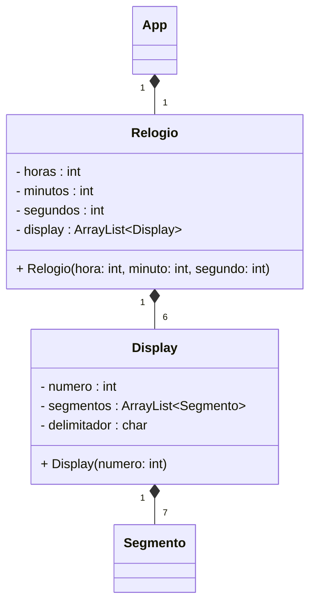

# Relógio Digital

```mermaid
classDiagram
direction TB

    App"1" *-- "1"Relogio
    Relogio"1" *-- "6"Display
    Display"1" *-- "7"Segmento

    class App {

    }

    class Relogio {
        - horas : int
        - minutos : int
        - segundos : int
        - display : ArrayList~Display~
        + Relogio(hora: int, minuto: int, segundo: int)
    }

    class Display {
        - numero : int
        - segmentos : ArrayList~Segmento~
        - delimitador : char
        + Display(numero: int)
    }

    class Segmento {

    }
```