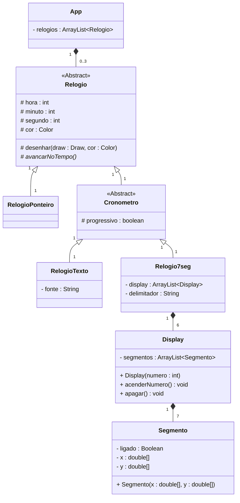

# Relógios e cronômetros

```mermaid
classDiagram

    App"1" *-- "0..3"Relogio
    Relogio"1" <|-- "1"RelogioPonteiro
    Relogio"1" <|-- "1"Cronometro
    Cronometro"1" <|-- "1"RelogioTexto
    Relogio7seg"1" *-- "6"Display
    Display"1" *-- "7"Segmento
    Cronometro"1" <|-- "1"Relogio7seg

    class App {
        - relogios : ArrayList~Relogio~
    }

    class Relogio {
        <<Abstract>>
        # hora : int
        # minuto : int
        # segundo : int
        # cor : Color
        # desenhar(draw : Draw, cor : Color)
        # avancarNoTempo()*

    }

    class Display {
        - segmentos : ArrayList~Segmento~
        + Display(numero : int)
        + acenderNumero() void
        + apagar() void
    }

    class Segmento {
        - ligado : Boolean
        - x : double[]
        - y : double[]
        + Segmento(x : double[], y : double[])
    }

    class Relogio7seg {
        - display : ArrayList~Display~
        - delimitador : String
    }

    class Cronometro {
        <<Abstract>>

        # progressivo : boolean
    }

    class RelogioTexto {
        - fonte : String
    }

    class RelogioPonteiro {

    }

```
