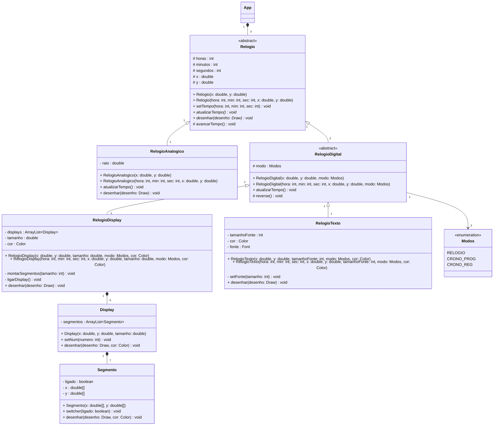

# Relógios e cronômetros

```mermaid
classDiagram
    
    App"1" *-- "3"Relogio
    Relogio"1" <|-- "1"RelogioAnalogico
    Relogio"1" <|-- "2"RelogioDigital
    RelogioDigital"1" <|-- "1"RelogioDisplay
    RelogioDigital"1" <|-- "1"RelogioTexto
    RelogioDigital"1" --> "3"Modos
    RelogioDisplay"1" *-- "6"Display
    Display"1" *-- "7"Segmento

    class Relogio {
        <<abstract>>
        # horas : int
        # minutos : int
        # segundos : int
        # x : double
        # y : double
        + Relogio(x: double, y: double)
        + Relogio(hora: int, min: int, sec: int, x: double, y: double)
        + setTempo(hora: int, min: int, sec: int) void
        + atualizarTempo() void*
        + desenhar(desenho: Draw) void*
        # avancarTempo() void
    }

    class RelogioAnalogico {
        - raio : double
        + RelogioAnalogico(x: double, y: double)
        + RelogioAnalogico(hora: int, min: int, sec: int, x: double, y: double)
        + atualizarTempo() void
        + desenhar(desenho: Draw) void
    }

    class RelogioDigital {
        <<abstract>>
        # modo : Modos
        + RelogioDigital(x: double, y: double, modo: Modos)
        + RelogioDigital(hora: int, min: int, sec: int, x: double, y: double, modo: Modos)
        + atualizarTempo() void
        # reverse() void
    }

    class RelogioDisplay {
        - displays : ArrayList~Display~
        - tamanho : double
        - cor : Color
        + RelogioDisplay(x: double, y: double, tamanho: double, modo: Modos, cor: Color)
        + RelogioDisplay(hora: int, min: int, sec: int, x: double, y: double, tamanho: double, modo: Modos, cor: Color)
        - montarSegmentos(tamanho: int) void
        - ligarDisplay() void
        + desenhar(desenho: Draw) void
    }

    class RelogioTexto {
        - tamanhoFonte : int
        - cor : Color
        - fonte : Font
        + RelogioTexto(x: double, y: double, tamanhoFonte: int, modo: Modos, cor: Color)
        + RelogioTexto(hora: int, min: int, sec: int, x: double, y: double, tamanhoFonte: int, modo: Modos, cor: Color)
        - setFonte(tamanho: int) void
        + desenhar(desenho: Draw) void
    }

    class Modos {
        <<enumeration>>
        RELOGIO
        CRONO_PROG
        CRONO_REG
    }

    class Display {
        - segmentos : ArrayList~Segmento~
        + Display(x: double, y: double, tamanho: double)
        + setNum(numero: int) void
        + desenhar(desenho: Draw, cor: Color) void
    }

    class Segmento {
        - ligado : boolean
        - x : double[]
        - y : double[]
        + Segmento(x: double[], y: double[])
        + switcher(ligado: boolean) void
        + desenhar(desenho: Draw, cor: Color) void
    }

    class App {

    }
```