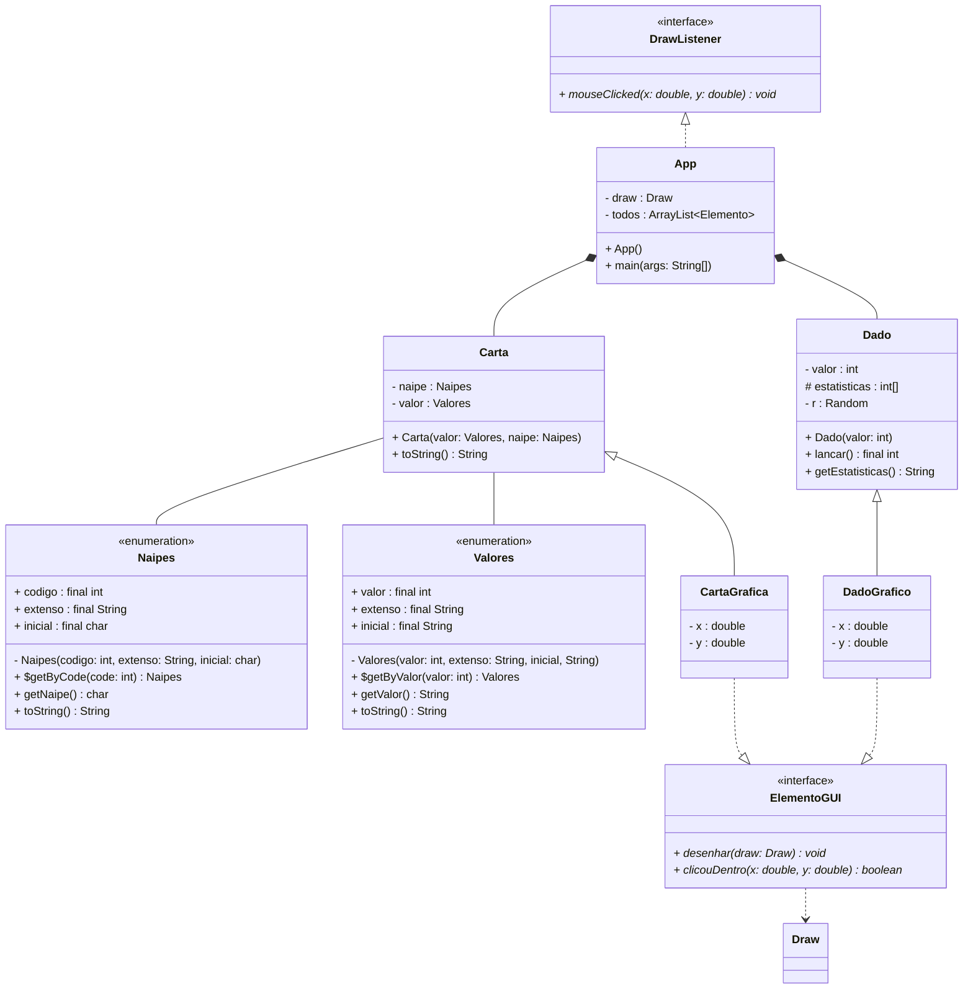

```mermaid
classDiagram

DrawListener <|.. App
App *-- Carta
Carta -- Naipes
Carta -- Valores
Carta <|-- CartaGrafica
CartaGrafica ..|> ElementoGUI

App *-- Dado
DadoGrafico ..|> ElementoGUI
Dado <|-- DadoGrafico
ElementoGUI ..> Draw

class DrawListener {
    <<interface>>
    + mouseClicked(x: double, y: double) void*
}

class App {
    - draw : Draw
    - todos : ArrayList~Elemento~
    + App()
    + main(args: String[]) 
}

class ElementoGUI {
    <<interface>>
    + desenhar(draw: Draw) void*
    + clicouDentro(x: double, y: double) boolean*
}

class Carta {
    - naipe : Naipes
    - valor : Valores
    + Carta(valor: Valores, naipe: Naipes)
    + toString() String
}

class CartaGrafica {
    - x : double
    - y : double
}

class Valores {
    <<enumeration>>
    + valor : final int
    + extenso : final String
    + inicial : final String
    - Valores(valor: int, extenso: String, inicial, String)
    + $getByValor(valor: int) Valores
    + getValor() String
    + toString() String    
}

class Naipes {
    <<enumeration>>
    + codigo : final int
    + extenso : final String
    + inicial : final char
    - Naipes(codigo: int, extenso: String, inicial: char)
    + $getByCode(code: int) Naipes
    + getNaipe() char
    + toString() String
}

class Dado {
    - valor : int
    # estatisticas : int[]
    - r : Random
    + Dado(valor: int)
    + lancar() final int
    + getEstatisticas() String
}

class DadoGrafico {
    - x : double
    - y : double
}

```